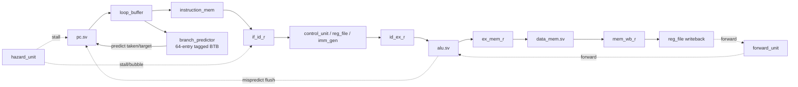
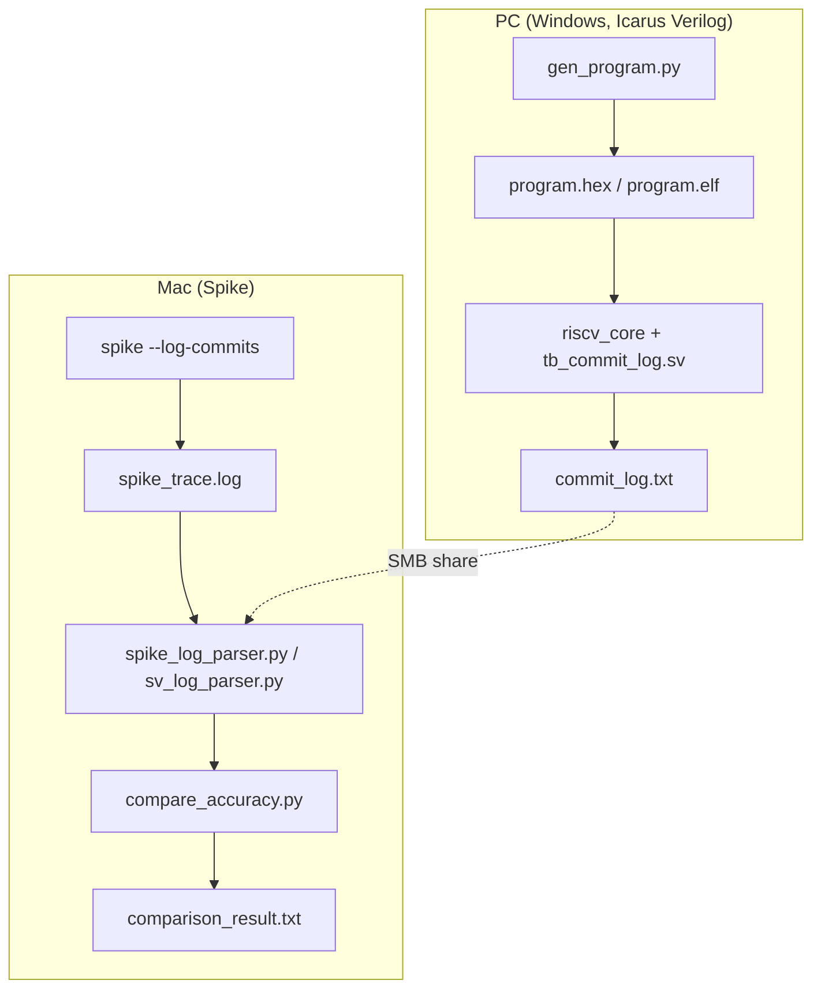

RV32I Pipelined Core with Golden-Model (Spike) Verification
I built this to get real hands-on practice with pipeline hazards and simulator-vs-simulator verification, not just write RTL that passes my own testbenches and call it done. It's a 5-stage RV32I core -- hazard detection, forwarding, tagged branch prediction, and a loop buffer for cheap "icache gating" power savings -- cross-checked against Spike, the reference RISC-V ISA simulator, instruction-by-instruction. Started life as a single-cycle simulator and grew from there.

What I'm proudest of: at larger random-program sizes, one specific loop kept running forever with no error, no X's, nothing the commit log alone could explain. Wrote a scratch testbench that dumps the loop buffer's internal state every cycle, watched a load-use stall get silently mis-recorded as a brand-new instruction, root-caused it precisely, fixed it, and then wrote `tb_loop_buffer_stall.sv` specifically so it can never quietly come back. More on that below.

Overview
The core (`riscv_core`) is a classic 5-stage pipeline -- IF, ID, EX, MEM, WB -- implementing the RV32I base integer ISA (no M/F/D extensions). A direct-mapped, tagged branch predictor drives fetch, a loop buffer sits in front of instruction memory to replay tight backward loops without re-fetching, and a hazard/forward unit pair handles the one hazard forwarding can't fix (load-use) plus everything it can.

Architecture
IF: pc.sv --if_pc--> loop_buffer --> instruction_mem
                          |
                          v
                 branch_predictor (64-entry tagged BTB, 2-bit BHT)
                          |
                          v
                     if_id_r (pipeline reg)
                          |
ID: control_unit + reg_file + imm_gen
    hazard_unit --stall--> freezes PC/IF-ID, bubbles ID/EX (load-use hazard)
                          |
                          v
                     id_ex_r
                          |
EX: alu.sv (forward_unit selects EX/MEM or MEM/WB operand)
    branch resolution --> mispredict flush back to IF
                          |
                          v
                     ex_mem_r
                          |
MEM: data_mem.sv
                          |
                          v
                     mem_wb_r
                          |
WB: register file writeback (+ same-cycle read/write bypass in reg_file.sv)

Prettier version (renders on GitHub)

**Hazards.** `hazard_unit.sv` catches the one case forwarding can't: a load's result isn't ready until the end of MEM, one stage later than every other producer, so if the instruction in EX is a load and the instruction in ID needs that register, the pipeline stalls exactly one cycle (freeze PC + IF/ID, bubble into ID/EX). Everything else -- EX/MEM and MEM/WB producers -- gets forwarded directly into the ALU operand mux, priority given to the closer one.

**Branch prediction.** Direct-mapped, 64 entries, 2-bit saturating counters. The original version had no tag field, and that was scarier than it sounds: two branch addresses hashing to the same index meant a trained "taken, jump to X" entry from one branch could get served to a completely unrelated instruction that happened to alias the same slot. Since `predict_taken` steers fetch in IF regardless of whether the current instruction is even a branch, this wasn't just a misprediction (which flushes for free) -- it could redirect fetch off a plain ALU instruction with nothing there to ever catch it, so wrong-path code just... executes for real. Fixed by adding a tag field to `branch_predictor.sv`; a false index hit now safely falls back to not-taken instead of a random jump. Regression-guarded by `tb_btb_tag_fix.sv`.

**Loop buffer.** Recognizes a backward-taken branch once the predictor's trained it, records the loop body into a small buffer on the pass where it's first seen, then replays instructions straight out of that buffer on every subsequent pass instead of re-fetching -- freezing ("gating") the icache address the whole time it does, which is the actual power-saving mechanism. Two real bugs here, both regression-guarded now:
- *Wraparound* -- the read index (`if_pc - loop_start`, shifted to a word offset) needs an explicit range check on `if_pc` itself, not just index math, or a backward exit could produce a false "valid" hit off unsigned wraparound; comparing against `write_ptr` also needs zero-extension or it silently breaks for a loop that fills the buffer exactly. `tb_loop_buffer_edgecases.sv` exists because I didn't trust myself to get this right the first time. I did not, in fact, get it right the first time.
- *The stall bug (the one from the top of this README)* -- RECORDING advanced its write pointer and captured the fetched instruction on *every* clock cycle, with no check for whether the pipeline had actually stalled that cycle. A load-use hazard inside a loop body freezes the fetch PC for one extra cycle (the pipeline's own correct stall, nothing wrong with that part on its own) -- but during RECORDING, that repeated cycle got captured as if it were a new instruction, shifting everything recorded after it by one buffer slot. By the loop's exit iteration, replay was quietly handing back the *decrement* instruction instead of the branch, so the branch never got re-evaluated, the counter blew straight through zero, and the loop never stopped. Not visible from the commit log alone -- found it with a scratch testbench dumping `loop_buffer`'s internal state every cycle, watched the write pointer hold steady during the stall instead of advancing. Fixed by giving `loop_buffer` a `stall` input and having RECORDING skip the write/advance on a stalled cycle. `tb_loop_buffer_stall.sv` is the regression test, and I checked it actually fails against the pre-fix RTL (loop counter landed on 17 instead of 5) before trusting that it passes for the right reason with the fix.

Verification Environment
PC (Windows, Icarus Verilog)                          Mac (Spike)
-----------------------------                         -----------
gen_program.py --> program.hex / program.elf
        |
        v
riscv_core + tb_commit_log.sv
        |
        v
commit_log.txt (SV retirement trace)
        |
        +-------------- SMB share (shared/spike/) -------------->
                                                          spike --log-commits program.elf
                                                                  |
                                                                  v
                                                          spike_trace.log
                                                                  |
                                                    spike_log_parser.py + sv_log_parser.py
                                                                  |
                                                                  v
                                                    compare_accuracy.py -- per-instruction diff
                                                                  |
                                                                  v
                                                          comparison_result.txt

Prettier version (renders on GitHub)

**Why a golden model at all.** I don't trust my own testbenches to catch everything -- learned that the hard way -- so the real correctness check is a per-instruction diff of this core's retirement trace against Spike's. The repo is split across a PC and a Mac, shared over an SMB folder, because Spike never built cleanly on Windows and I didn't feel like fighting it: the PC compiles and runs the SV core in Icarus Verilog and produces `commit_log.txt` plus the program hex/elf; the Mac runs Spike against the same elf and diffs the two traces.

**Test generation (`gen_program.py`).** Generates random RV32I programs restricted to the subset the core actually implements correctly, plus real bounded loops (init counter, random body, decrement, backward branch) interleaved into the stream so the loop buffer's replay path gets exercised by something other than hand-written directed tests. `data_mem` used to cap this at ~15 instructions (only 256B, and the generator has to fit the whole program plus a load/store scratch region inside it); bumped it to 4KB to match `instruction_mem`, which unlocked programs up into the hundreds of instructions. That size increase surfaced real bugs the small scale never hit:
- **x31 base-register math** -- the load/store base register is computed relative to the program's own address (`auipc` + `addi`). First version placed it 124 bytes too high (forgot `auipc`'s own PC needs accounting for), so every load through it read Icarus's undefined `x`. Fixed that, then hit a second, sneakier one: with no margin left, a negative store offset could land back inside the program's own not-yet-executed instructions -- genuine self-modifying code under Spike's unified memory model, invisible on the SV side since `instruction_mem` and `data_mem` are separate arrays there. Gave x31 a full 32-byte window past the end of the program so the most-negative store offset can never reach back into it.
- **A 12-bit immediate doesn't care how big your program is** -- that same x31 setup used a single `addi` to carry the whole offset, and at n=700 the offset (2836) exceeded what a signed 12-bit immediate (+-2047) can hold. Encoding it anyway silently truncated and sign-flipped it, landing x31 on a wildly wrong address and pushing every load/store through it out of bounds -- which Icarus correctly returns `x` for. Fixed with the standard `auipc`+`addi` hi20/lo12 split real toolchains use for `%pcrel_hi`/`%pcrel_lo` relocations, so it holds for any program size.
- **JAL's return address is base-address-dependent** -- the SV core boots from PC=0, Spike loads the same bytes at 0x80000000, so the same `jal` computes a small value on one side and a `~0x8000xxxx` value on the other. Fine for each simulator's own execution, until a later random instruction used that register as an operand to anything sign-sensitive (SRA, SLT, BLT, BGE) and the two simulators legitimately computed different answers. Traced a real failure to `srai x2,x5,1` where x5 held a JAL return address: Spike's had the sign bit set, the SV core's didn't -- neither side was wrong, they just didn't have the same x5. Fixed by forcing JAL's `rd` to x0; the generator only ever needed JAL's squash-on-taken behavior, never real call/return linkage.
- **Two ways to write a permanent deadlock into a random generator** -- JAL is unconditional, so a randomly-chosen backward JAL with nothing able to conditionally escape is a guaranteed deadlock the instant it's reached. A backward *conditional* branch doesn't even need a bug to do the same thing -- if the registers it compares don't happen to get touched again before it's next reached, it can evaluate "taken" forever, purely by bad luck. Fixed both by making JAL and top-level branches forward-only; backward branches didn't disappear, every generated loop's own decrement-guarded branch is still a real one, just provably terminating by construction.
- **My own "safe" fallback wasn't** -- the exclusion logic that stops a random JAL/branch from targeting inside a loop block had a fallback for when nothing in range was safe, and that fallback silently discarded the exclusion and picked an unsafe target anyway -- reintroducing the exact deadlock it existed to prevent, whenever two loop blocks happened to sit back-to-back. Lesson: a fallback that avoids crashing isn't the same thing as a fallback that's actually safe. Fixed by emitting a harmless instruction instead when there's nowhere safe to jump.

**Regression testbenches (`rtl/tb_*.sv`).** One directed testbench per feature or bug, each checking a specific thing rather than re-deriving the whole pipeline:
- `tb_riscv_core.sv` -- full pipeline sanity: forwarding chains, load-use stall, branch/JAL/JALR misprediction + squash, LUI/AUIPC
- `tb_slti_sltiu.sv` -- signed vs. unsigned set-less-than, forwarded from both EX/MEM and MEM/WB
- `tb_btb_tag_fix.sv` -- confirms an aliased BTB index no longer produces a wrong-target prediction
- `tb_loop_buffer.sv` -- loop buffer reaches PLAYBACK and INVALID, captures the right bytes
- `tb_loop_buffer_edgecases.sv` -- buffer-full and backward-exit wraparound cases
- `tb_loop_buffer_stall.sv` -- the load-use-stall-during-RECORDING regression described above
- `tb_icache_gating.sv` -- gated address never changes mid-freeze, gating tracks `loop_active` exactly
- `tb_commit_log.sv` -- not a pass/fail check, the actual trace tap used for Spike comparison

Results so far: batch 1 (1 handwritten + 8 random programs, all n<=15) and batch 2 (10 random programs, n=50 through n=700, including loop-heavy ones) all match Spike at 100%. Full trail of what broke getting batch 2 there is in `shared/spike/batch2/MANIFEST2.txt`.

Repository Structure
rtl/
  riscv_core.sv               top-level pipeline integration
  pc.sv                        program counter
  instruction_mem.sv           4KB instruction memory
  instruction_mem_bram.sv      alternate BRAM-style i-mem (unused, exploratory)
  data_mem.sv                  4KB data memory
  control_unit.sv               opcode decode -> control signals
  reg_file.sv                   32x32 register file, same-cycle write/read bypass
  imm_gen.sv                    immediate extraction / sign-extend
  alu.sv                        ALU ops
  forward_unit.sv               EX/MEM, MEM/WB forwarding
  hazard_unit.sv                load-use stall detection
  branch_predictor.sv           64-entry tagged BTB + 2-bit BHT
  loop_buffer.sv                tight-loop instruction replay + icache gating
  riscv_pkg.sv                  shared pipeline-register typedefs
  tb_*.sv                       directed regression testbenches (see above)

shared/spike/                  SMB share with the Mac -- see Verification Environment
  gen_program.py                random RV32I test-program generator
  run_spike.py                  drives Spike against program.elf
  spike_log_parser.py           parses Spike --log-commits output
  sv_log_parser.py              parses commit_log.txt
  compare_accuracy.py           diffs the two retirement traces
  boot.s, link.ld, hello.c, main.c   bring-up program for Spike
  batch/, batch2/                generated test-program batches + comparison results
  RUN_ON_MAC.txt, RUN_BATCH_ON_MAC.txt, RUN_BATCH2_ON_MAC.txt   cross-machine run notes

Build & Run
Requires Icarus Verilog 12.x (oss-cad-suite works well) on the RTL side, and Spike (riscv-isa-sim) on a Unix-like machine for cross-checking -- it doesn't build cleanly on Windows.

# Compile + run a directed testbench (from rtl/)
iverilog -g2012 -o sim.vvp \
  riscv_pkg.sv alu.sv pc.sv imm_gen.sv control_unit.sv reg_file.sv \
  instruction_mem.sv data_mem.sv forward_unit.sv hazard_unit.sv \
  branch_predictor.sv loop_buffer.sv riscv_core.sv tb_riscv_core.sv
vvp sim.vvp

# Golden-model comparison (from shared/spike/)
python3 gen_program.py <seed> <n>          # -> program.hex, program.elf
# compile/run tb_commit_log.sv against program.hex -> commit_log.txt (PC side)
spike -l --log-commits --isa=rv32i --instructions=5000 program.elf 2> spike_trace.log   # Mac side
python3 compare_accuracy.py spike_trace.log commit_log.txt
